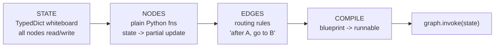
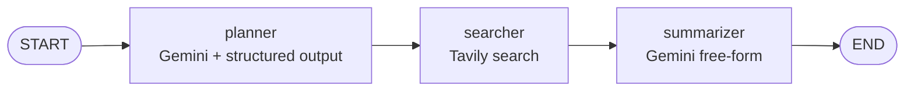

# Module 1 — LangGraph Fundamentals

The four building blocks of every LangGraph app, introduced one or two at a time.

| File | Stage | Concepts |
|---|---|---|
| [`01_hello_graph.py`](01_hello_graph.py) | 1 | State (`TypedDict`), Nodes, Edges, `compile()`, `invoke()` |
| [`02_two_node_graph.py`](02_two_node_graph.py) | 2–3 | Reducers (`Annotated[list, add]`), multi-node sequencing |
| [`03_llm_and_tools.py`](03_llm_and_tools.py) | 4–5 | Real Gemini calls, structured output (Pydantic), Tavily tool calls |

---

## The 4 building blocks

## Module-end graph (Stage 4–5)

## Module 1 → Module 2 cliffhanger

By the end of Stage 5 we have a linear DAG. Module 2 introduces parallelism, branching, cycles, and subgraphs — the four control-flow patterns that turn a pipeline into a system.
