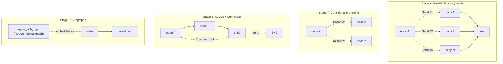
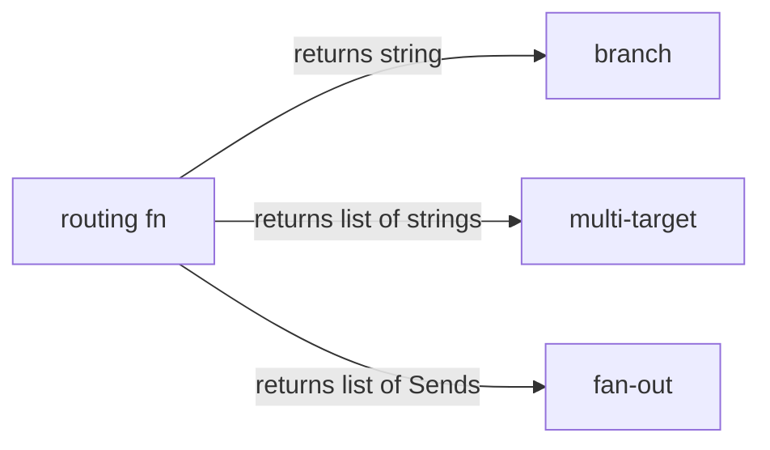
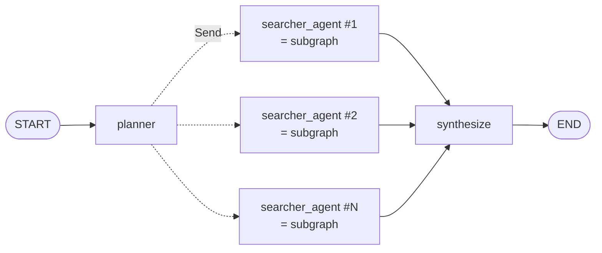

# Module 2 — Graph Control Flow

The four control-flow patterns that take you from "a pipeline" to "a system": parallelism, branching, cycles, and encapsulation.

| File | Stage | Concepts |
|---|---|---|
| [`04_parallel_fanout.py`](04_parallel_fanout.py) | 6 | `Send` API — fan out N workers in parallel; reducers under load |
| [`05_conditional_edges.py`](05_conditional_edges.py) | 7 | `add_conditional_edges()` for routing/branching |
| [`06_cycles_and_command.py`](06_cycles_and_command.py) | 8 | Cycles + `Command(goto=..., update=...)` for handoffs |
| [`07_subgraphs.py`](07_subgraphs.py) | 9 | Encapsulating an "agent" as a `StateGraph`, embed in parent |

---

## The four patterns at a glance

## The unified API mental model

`add_conditional_edges` is one API with three uses, depending on what the routing function returns:

`Command` is a *separate* primitive that fuses state-update + routing into one return value — used inside nodes (commonly for cycles).

## Module-end shape (Stage 9 capstone preview)

This shape is already 80% of what the capstone swarm looks like. From here on, each later stage adds quality-control machinery (Critic, Fact-Checker, trust scoring) on top of this skeleton.
