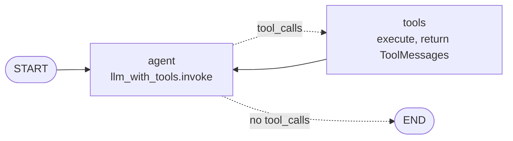
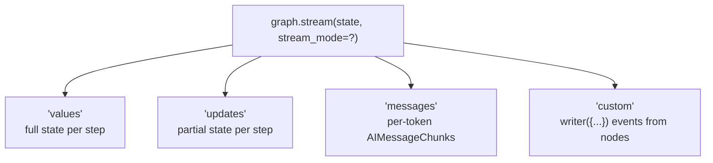
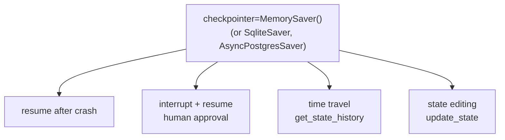
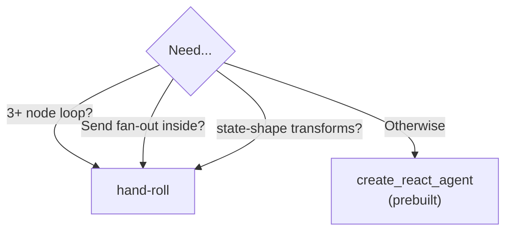

# Module 3 — Agent Patterns

Now that we know graphs, we build agents that *think and act*: tool-using ReAct loops, real-time streaming, and human-in-the-loop checkpointing.

| File | Stage | Concepts |
|---|---|---|
| [`08_streaming_modes.py`](08_streaming_modes.py) | 10 | `.stream()` modes: `values`, `updates`, `messages`, `custom` |
| [`09_react_from_scratch.py`](09_react_from_scratch.py) | 11 | Build the ReAct loop yourself: `bind_tools`, `tool_calls`, `ToolMessage` |
| [`10_prebuilt_react_agent.py`](10_prebuilt_react_agent.py) | 12 | `create_react_agent` — system prompt, hooks, structured output, embed as subgraph |
| [`11_human_in_the_loop.py`](11_human_in_the_loop.py) | 13 | Checkpointing, `interrupt()`, `Command(resume=...)`, time-travel |

---

## The ReAct loop (the spine of every tool-using agent)

## Streaming modes - which yields what

## Checkpointing unlocks 4 capabilities

## Prebuilt vs hand-rolled ReAct (the decision)

## What you can build by the end of Module 3

A real interactive tool-using agent that streams its work to the UI, pauses for human approval on expensive operations, and can be rewound and replayed.
