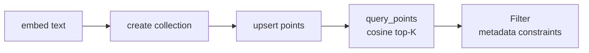
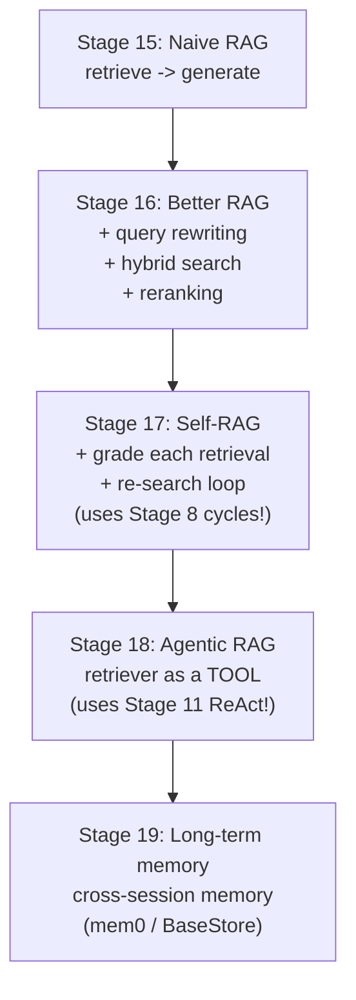
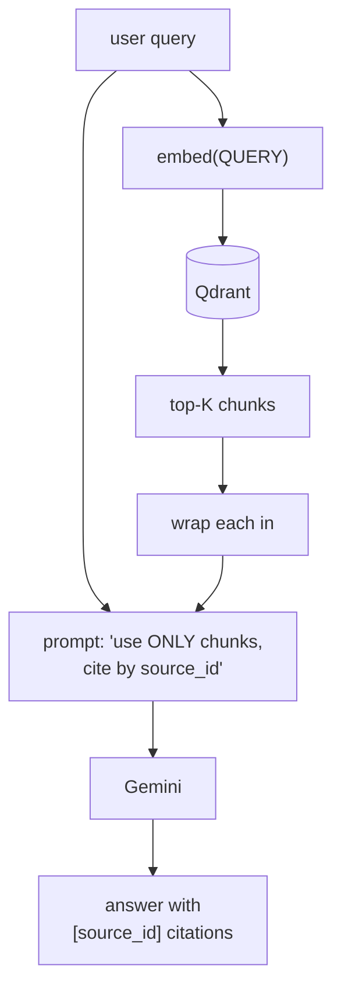
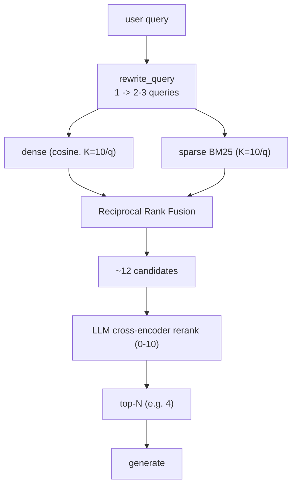
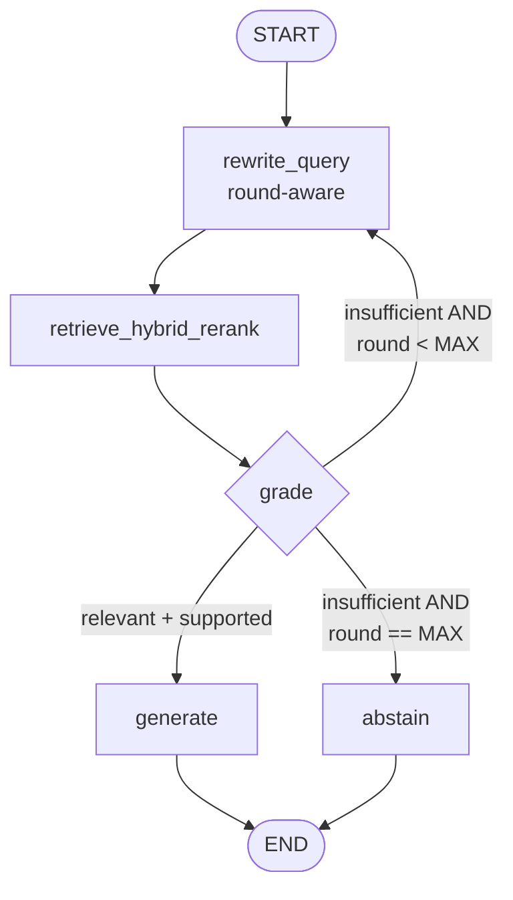
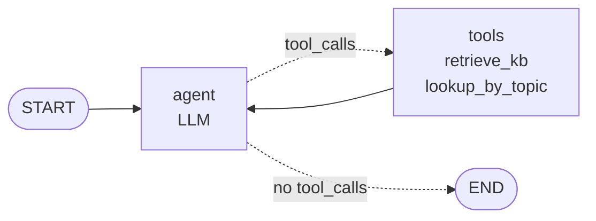
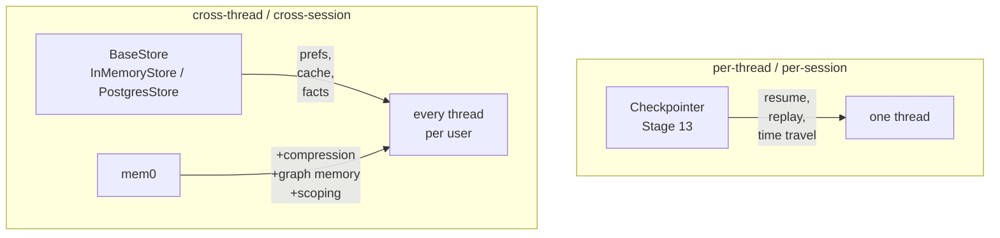
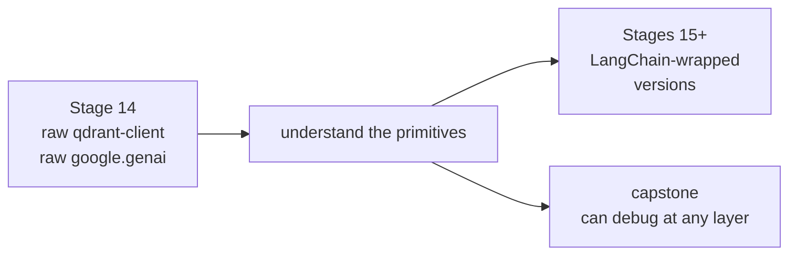

# Module 4 — Memory & RAG

The agent's eyes and ears: embeddings, vector search, and the family of retrieval-augmented patterns that turn an LLM into a researcher.

| File | Stage | Concepts |
|---|---|---|
| [`12_qdrant_basics.py`](12_qdrant_basics.py) | 14 | Embeddings (`gemini-embedding-001`), Qdrant collections, upsert + search, metadata filters — *no LangChain*, raw clients |
| [`13_naive_rag.py`](13_naive_rag.py) | 15 | 2-node RAG (`retrieve → generate`); tagged-chunk prompt-injection defense; citations by `source_id` |
| [`14_better_rag.py`](14_better_rag.py) | 16 | Query rewriting (LLM expansion), hybrid search (dense + BM25 + RRF), LLM cross-encoder reranker |
| [`15_self_rag.py`](15_self_rag.py) | 17 | Graded retrieval + re-search loop (`Command` cycles applied to RAG); explicit abstain path |
| [`16_agentic_rag.py`](16_agentic_rag.py) | 18 | Retriever-as-`@tool` exposed to a `create_react_agent`; agent picks if/when/with-what to retrieve |
| [`17_long_term_memory.py`](17_long_term_memory.py) | 19 | LangGraph `BaseStore` (`InMemoryStore`), `InjectedStore` in tools, `pre_model_hook` to inject memory; mem0 mapping |

---

## The 5 primitives every RAG paper composes



## The RAG family tree



Each stage REUSES patterns from earlier modules:
- Self-RAG = Module 2 cycles applied to RAG
- Agentic RAG = Module 3 ReAct with a retriever tool
- Long-term memory = Module 3 checkpointing + cross-thread store

## End-to-end naive RAG (Stage 15)



## Better RAG funnel (Stage 16): wide net, then narrow



Two intuitions to internalise:

- **Hybrid > either alone.** Dense catches synonyms ("fan out" ≈ "parallel workers"), BM25 nails exact terms ("Send API"). RRF fuses ranked lists without needing calibrated scores from either side.
- **Bi-encoder vs cross-encoder.** Embeddings (bi-encoder) score query and chunk separately and compare. A reranker (cross-encoder) sees them together — slow but much better at "does THIS chunk answer THIS question?". Standard pattern: bi-encoder fetches ~20 fast, cross-encoder picks the best 4.

## Self-RAG loop (Stage 17): grade then loop or abstain



This is the **Stage 8 critic-loop pattern applied to RAG** — same `Command(goto=..., update=...)` machinery, same termination invariants (LLM signal first, hard counter second). The critic grades on two axes:

- **Relevance** — are the retrieved chunks even on-topic?
- **Support** — do the on-topic chunks actually contain the facts to answer?

Both must be true to proceed to `generate`. If either fails and budget remains, we loop with an *aggressive* rewrite that's been told what was missing. If budget is exhausted, we **abstain** explicitly — a separate node so abstain shows up in eval traces as a first-class outcome, not a confidently-wrong answer.

## Agentic RAG (Stage 18): retriever as a tool



Stages 15–17 all go `retrieve → reason`. Stage 18 flips it: **`reason about whether to retrieve`**. The retriever is wrapped as a `@tool` and handed to `create_react_agent`. Trivial questions skip retrieval entirely; comparison questions trigger multiple retrievals at different angles; off-topic questions either skip the tool or abstain after seeing weak rerank scores. Two design rules to bake in:

- **Tool docstrings ARE prompts.** The LLM picks tools based on the docstring alone — write them like a function spec for a colleague (when to use, when not to, argument semantics, return shape).
- **Tools return strings, not objects.** The LLM only sees `ToolMessage.content`. Format as tagged `<retrieved_chunk source_id="...">` blocks with rerank scores visible so the model can self-assess.

This is the shape of the capstone Searcher — a ReAct agent restricted to `{retrieve_kb, mem0_read, tavily_search}`.

## Long-term memory (Stage 19): the two-layer model



Three namespaces from `PROJECT2_PLAN.md` sec 3 D2:

```
("prefs",      user_id) -> {citation_style, depth, ...}
("subq_cache", user_id) -> {q -> top_chunks, ts}
("facts",      user_id) -> {claim, sources, trust}
```

New primitives in this stage:

- **`InMemoryStore` + `InjectedStore`** — the store is plumbed into the agent at compile time; tools that declare `Annotated[BaseStore, InjectedStore()]` get it injected at call time. The LLM never sees the store argument.
- **`pre_model_hook`** — fetches relevant prefs + facts BEFORE every LLM call and prepends them as a `[memory]` system message. Same hook will host the kill-switches in Module 5.
- **Per-user namespaces via `RunnableConfig`** — pass `config={"configurable": {"user_id": ...}}`; tools read it to scope reads/writes. Free multi-tenant.

mem0 is `BaseStore` + LLM-driven write compression + first-class scoping + optional graph memory. The capstone hides both behind a `MemoryBackend` Protocol (`PROJECT2_PLAN.md` sec 13) so swapping is mechanical.

## Why we built Qdrant raw first (Stage 14)



When LangChain's `Qdrant` wrapper does something weird (and it will), you'll know whether the bug is in your code, the wrapper, or Qdrant itself — because you've used Qdrant directly.
