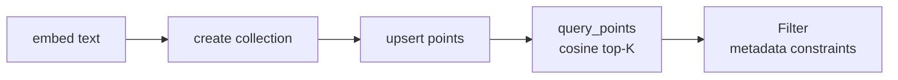
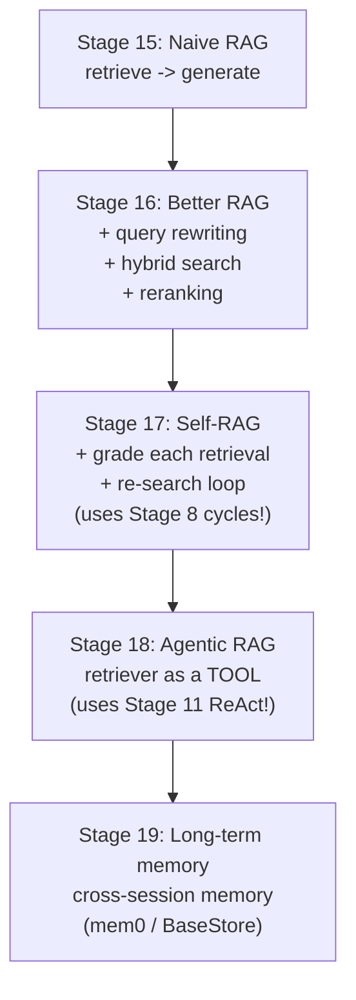
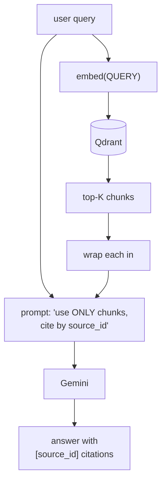
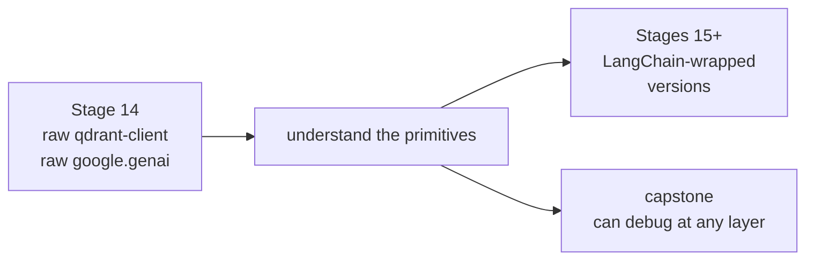

# Module 4 — Memory & RAG

The agent's eyes and ears: embeddings, vector search, and the family of retrieval-augmented patterns that turn an LLM into a researcher.

| File | Stage | Concepts |
|---|---|---|
| [`12_qdrant_basics.py`](12_qdrant_basics.py) | 14 | Embeddings (`gemini-embedding-001`), Qdrant collections, upsert + search, metadata filters — *no LangChain*, raw clients |
| [`13_naive_rag.py`](13_naive_rag.py) | 15 | 2-node RAG (`retrieve → generate`); tagged-chunk prompt-injection defense; citations by `source_id` |
| `14_better_rag.py` (planned) | 16 | Query rewriting, hybrid search, reranking |
| `15_self_rag.py` (planned) | 17 | Graded retrieval + re-search loop (graph-shaped RAG) |
| `16_agentic_rag.py` (planned) | 18 | Retriever-as-tool — LLM decides whether to retrieve |
| `17_long_term_memory.py` (planned) | 19 | LangGraph `BaseStore`, `InMemoryStore` → `PostgresStore`; mem0 |

---

## The 5 primitives every RAG paper composes

## The RAG family tree

Each stage REUSES patterns from earlier modules:
- Self-RAG = Module 2 cycles applied to RAG
- Agentic RAG = Module 3 ReAct with a retriever tool
- Long-term memory = Module 3 checkpointing + cross-thread store

## End-to-end naive RAG (Stage 15)

## Why we built Qdrant raw first (Stage 14)

When LangChain's `Qdrant` wrapper does something weird (and it will), you'll know whether the bug is in your code, the wrapper, or Qdrant itself — because you've used Qdrant directly.
